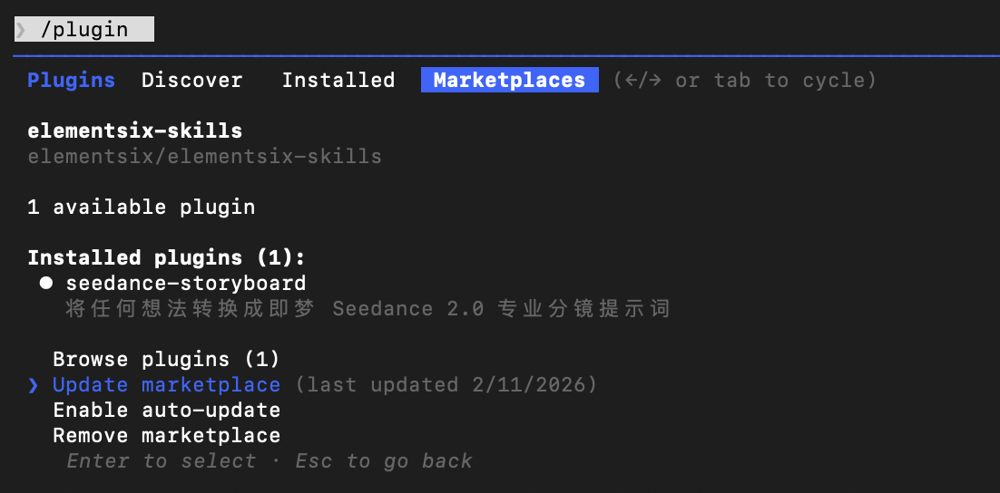

# 🎬 Seedance Storyboard - ElementSix Skills

<p align="center">
  
  &nbsp;
  
  &nbsp;
  <a href="LICENSE"></a>
  &nbsp;
  
</p>

<p align="center">
  <b>A Claude Code Skill that transforms any idea into professional storyboard prompts for Jimeng Seedance 2.0</b>
</p>

<p align="center">
  <a href="README.md">中文</a> | <a href="README_EN.md">English</a>
</p>

## 📖 Introduction

Seedance 2.0 is a powerful multimodal AI video generation model by Jimeng (CapCut), but writing good prompts can be challenging for most people. This Skill guides you step-by-step to transform simple ideas into professional storyboard prompts.

## ✨ Features

### 🎯 Core Capabilities
- ✅ **Step-by-step Guidance** - Complete workflow from idea to full prompt
- ✅ **Full Feature Coverage** - Supports all Seedance 2.0 features (multimodal, extension, editing, etc.)
- ✅ **Professional Templates** - Built-in 6 storyboard templates
- ✅ **Chinese Optimized** - Specifically designed for Chinese users

### 🚀 v1.1.0 New Features
- 🔥 **Video Extension** - Continue filming from existing videos with smooth transitions
- 🔥 **Complex Camera Work** - Precise replication of Hitchcock zoom, orbiting shots, one-take sequences
- 🔥 **Effect Replication** - Transformation effects, particle effects, puzzle transitions
- 🔥 **Character Consistency** - Maintain consistent character appearance across continuous narratives
- 🔥 **Multi-scene Fusion** - Seamless transitions and free spatial transformation

## 🚀 Installation

### 📋 Prerequisites

- You need to have [Claude Code](https://claude.ai/code) installed first

### 🛠️ Installation Steps

```bash
# 1. Add Marketplace
/plugin marketplace add elementsix/elementsix-skills

# 2. Install Skill
/plugin install seedance-storyboard@elementsix-skills
```

### ✅ Activation

- **Exit Claude Code and re-enter** after installation, then the `/seedance-storyboard` command will be available

## 🔄 Update Skill

To update the Skill to the latest version:

1. Run `/plugin` in Claude Code
2. Switch to the **Marketplaces** tab (use arrow keys or Tab)
3. Select `elementsix-skills`
4. Select **Update marketplace**

You can also select **Enable auto-update** to automatically get the latest version on each startup.



## 🎯 Usage

After installation, use the following command:

```bash
/seedance-storyboard
```

Then Claude will guide you step-by-step:

1. **Understand Your Idea** - What story do you want to tell?
2. **Deep Dive** - Style, camera movements, actions, sound
3. **Build Storyboard** - Break down shots on a timeline
4. **Generate Prompt** - Output professional ready-to-use prompts
5. **Optimization Tips** - Provide improvements and multimaterial suggestions

## 💡 Examples

### Example 1: Traditional Dance

**Your Idea**: "A girl dancing under cherry blossoms"

**Generated Prompt**:
```
Cinematic realistic style, 15 seconds, 16:9 widescreen, warm atmosphere at sunset golden hour

0-3s: Wide shot slowly pushing in, sea horizon at sunset, girl silhouette standing on beach, skirt swaying in sea breeze
3-7s: Medium orbiting shot, girl begins spinning and dancing, long hair and skirt flying, sunset backlight creating rim light
7-11s: Close-up follow shot, girl dancing toward camera, expression free and joyful, waves gently hitting beach as background
11-13s: Extreme close-up of hand movements, fingers sweeping across sunset, light and shadow flowing at fingertips
13-15s: Wide shot pulling back, girl frozen in sunset afterglow, screen gradually darkens

Background sound: Waves + gentle piano music
```

### Example 2: Hitchcock Zoom (v1.1.0 New)

**Materials**: @image1 (male character), @image2 (elevator scene), @video1 (camera reference)

**Prompt**:
```
Reference @image1 for male character, he is in @image2 elevator, fully reference @video1's camera work
and protagonist's facial expressions, Hitchcock zoom when protagonist is frightened, then several orbiting
shots showing elevator interior perspective, elevator door opens, follow shot walking out of elevator,
man looks around
```

### Example 3: Video Extension (v1.1.0 New)

**Materials**: @video1 (original video), @image1-2 (character references)

**Prompt**:
```
Extend 15s video, reference @image1, @image2 for donkey riding motorcycle image, add a creative ad segment
Scene 1: Side static shot, donkey riding motorcycle bursting through fence, chickens nearby startled
Scene 2: Donkey riding motorcycle circling in sand, close-up of tire first, then aerial shot of donkey
riding motorcycle doing circling stunts, raising smoke
Scene 3: Snow mountain background, donkey riding over hillside, advertising text appears behind subject
through masking (as donkey and motorcycle fly by) showing "Inspire Creativity, Enrich Life",
finally dust raised as motorcycle passes
```

### Example 4: Transformation Effect (v1.1.0 New)

**Materials**: @video1 (effect reference), @image1 (first frame character), @image2 (final appearance)

**Prompt**:
```
Replace @video1's first frame character with @image1, fully reference @video1's effects and movements,
rose petals grow from flower stamen in hand, cracks extend upward on face, gradually covered by weeds,
character sweeps hands across face, weeds turn into particles and dissipate, finally becomes @image2's appearance
```

**More examples** see `skills/seedance-storyboard/README.md`

## 📁 File Structure

```
elementsix-skills/
├── .claude-plugin/
│   └── marketplace.json              # Marketplace configuration
├── README.md                         # This file (Chinese)
├── README_EN.md                      # English version
└── skills/
    └── seedance-storyboard/          # Main Skill directory
        ├── SKILL.md                  # Skill core logic
        ├── README.md                 # Skill detailed description
        ├── quick-reference.md        # Quick reference card
        ├── templates/
        │   └── storyboard-template.md    # 6 storyboard templates
        └── examples/
            └── example-prompts.md        # 10 complete examples
```

## 🎬 Seedance 2.0 Core Capabilities

### 📊 Technical Specifications

| Input Type | Supported Formats | Quantity Limit | Size Limit |
|-----------|-------------------|----------------|------------|
| **Images** | jpeg, png, webp, bmp, tiff, gif | ≤ 9 | < 30 MB |
| **Video** | mp4, mov (2-15s) | ≤ 3 | < 50 MB |
| **Audio** | mp3, wav (≤15s) | ≤ 3 | < 15 MB |
| **Text** | Natural language description | - | - |
| **Mixed Limit** | **12 files total** | | |

> 💡 Tip: Video references consume more generation credits. Prioritize uploading materials with the most impact on visuals.

### 🎯 Core Features

| Feature | Description |
|---------|-------------|
| **Multimodal Input** | Free combination of images, video, audio, and text |
| **Reference Images** | Precisely replicate composition, character details, costume styles |
| **Reference Video** | Support camera language, complex action rhythm, creative effect replication |
| **Video Extension** | Smooth extension and connection, can "continue filming" |
| **Video Editing** | Character replacement, plot subversion, segment adjustment, scene fusion |
| **Basic Enhancement** | More reasonable physics, more natural movements, more precise instruction understanding |

## 📝 Prompt Syntax

### Basic Syntax
Use `@material_name` to reference multimodal materials:

```
@image1 as first frame
@image2 as character reference
@video1 for camera movement reference
@audio1 for background music
```

### Advanced Usage

| Scenario | Syntax Example |
|----------|---------------|
| **First Frame + Video Action** | `@image1 as first frame, reference @video1 fighting action` |
| **Video Extension** | `Extend @video1 by 5s` (select "new portion" duration) |
| **Character Replacement** | `Replace girl in @video1 with @image1 appearance` |
| **Full Camera Replication** | `Fully reference @video1 camera work and expressions` |
| **Multi-video Fusion** | `Add scene between @video1 and @video2, content is xxx` |
| **Reference Video Audio** | `Use @video1 background music and rhythm` |

## 🔗 Jimeng Platform Info

- **Official Website**: https://jimeng.jianying.com
- **Entry Points**: Seedance 2.0 - Universal Reference / First-Last Frame

### ⚠️ Important Limitations

- **Photorealistic human faces not supported** (images and videos will be automatically blocked)
- **Video references consume more generation credits**
- **Video pixel range**: 640×640 (480p) to 834×1112 (720p)
- **Mixed input total limit**: 12 files

### 💡 Usage Tips

1. Prioritize uploading materials with the most impact on visuals or rhythm
2. When using multiple multimodal materials, ensure @object references are clear
3. Video extension: select duration for "new portion" only
4. Complex camera work: use "fully reference @video1 camera work" for precise replication

## 🤝 Contributing

Issues and PRs are welcome!

## 📄 License

MIT License

---

## ⭐ Star History

<p align="center">
  <a href="https://star-history.com/#elementsix/elementsix-skills&Date">
    
  </a>
</p>
